# Getting Started with fabric_devops

This guide walks you through the basic stapes of getting up and running
with **fabric_devops** project. This will allow you to write, test and
debug Python code which automates CI/CD tasks in Fabric-based solutions
using the Fabric REST APIs. You will begin by configuring your developer
environment so you run Python code locally on your computer in the
Visual Studio Code debugger. After that, you will move through the
configuration steps to enable the same Python code to run in the cloud
within the context of a GitHub workflow.

Begin by forking the **fabric_devops** repository.

1.  Navigate to the repository in the browser at
    <https://github.com/FabricDevCamp/fabric-devops>.

2.  Drop down the **Fork** menu in the upper right of the page.

3.  Select the **Create a new fork** command.


Next, select the **Create fork** command.

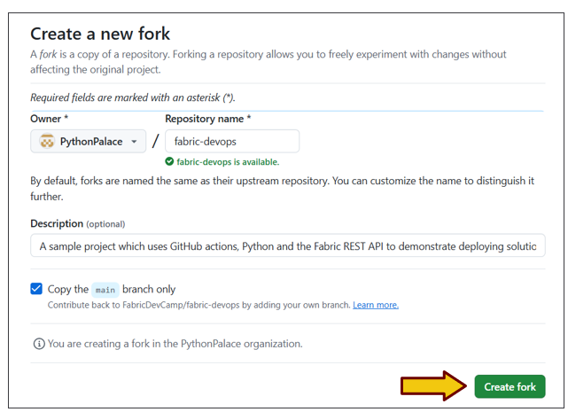

This forked repository is your starting point. This is the repository in
which you will test and experiment with Python code

The next step is to clone this repository to a local folder for testing
in Visual Studio Code

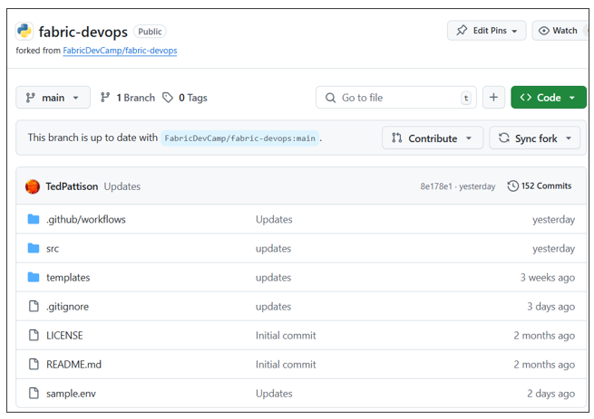

Use git clone command or equivalent to copy files from repo to local
project folder.

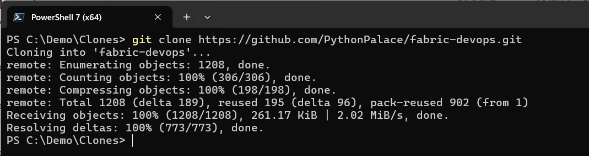

Open the project in Visual Studio Code.

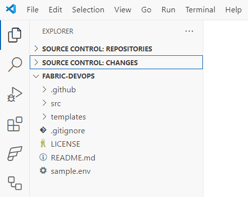

## Updating Configuration in the Local .env File

Steps to add configuration for local debugging

Rename the sample.env file to .env

Update environmental variables in the .env file

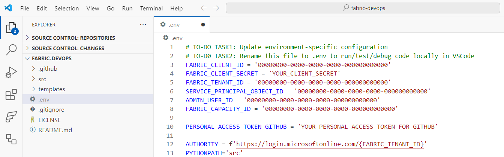

Here is what you need to edit.

- Configuration for Entra Id application used to authenticate as service
  principal

  - **FABRIC_CLIENT_ID**

  - **FABRIC_CLIENT_SECRET**

  - **FABRIC_TENANT_ID**

  - **SERVICE_PRINCIPAL_OBJECT_ID**

- The Azure object Id for your Entra Id user account

  - **ADMIN_USER_ID**

- Capacity Id

  - **FABRIC_CAPACITY_ID**

- Personal access token used to create connections between Fabric
  workspace and GitHub

  - **PERSONAL_ACCESS_TOKEN_GITHUB**

Sss

**fabric_devops** Library exposes set of classes

- **EnvironmentSettings**

- **AppLogger**

- **EntraIdTokenManager**

- **FabricRestApi**

- **ItemDefinitionFactory**

- **VariableLibrary**

- **DeploymentManager**

- **StagingEnvironments**

- **SampleCustomerData**

- **AdoProjectManager**

- **GitHubRestApi**

## EnvironmentSettings Class

EnvironmentSettings class provides access to environmental variables

Environmental variables loaded using os.getenv function

When running locally in Visual Studio Code, environmental variables
loaded from .env file

When running locally in GitHub workflows, environmental variables loaded
action secrets

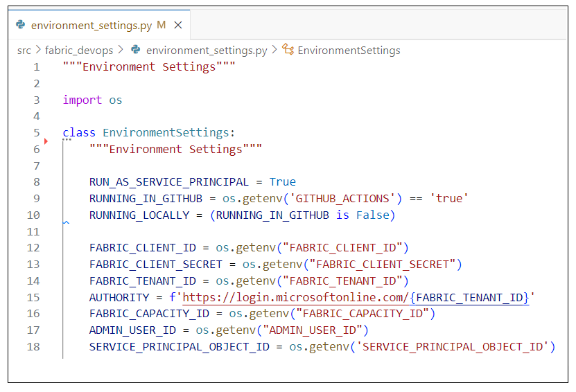

## Authenticating with MSAL

Authentication and token acquisition in the fabric_devops project is
implemented using Microsoft Authentication Library (MSAL) for Python

- MSAL used to authenticate with Entra Id and acquire access tokens

  - MSAL provides **ConfidentialClientApplication** used acquire access
    tokens for service principals

  - MSAL provides **PublicClientApplication** used acquire access tokens
    for service principals

- Installing MSAL

  - Library installed from Python Package Index (PyPI) at
    **https://pypi.org/project/msal/**

  - Install command from terminal in Visual Studio Code: **pip install
    msal**

- Permission scopes for requesting access tokens for Fabric REST APIs

  - For service principal tokens:
    **https://api.fabric.microsoft.com/.default**

  - For user tokens:
    **https://api.fabric.microsoft.com/user_impersonation**

## Running Demo Scripts

Once configuration Is set, you can run demo scripts

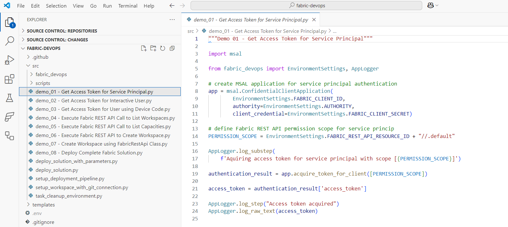

### Demo 01 - Acquire Access Token for Service Principal

Sssss

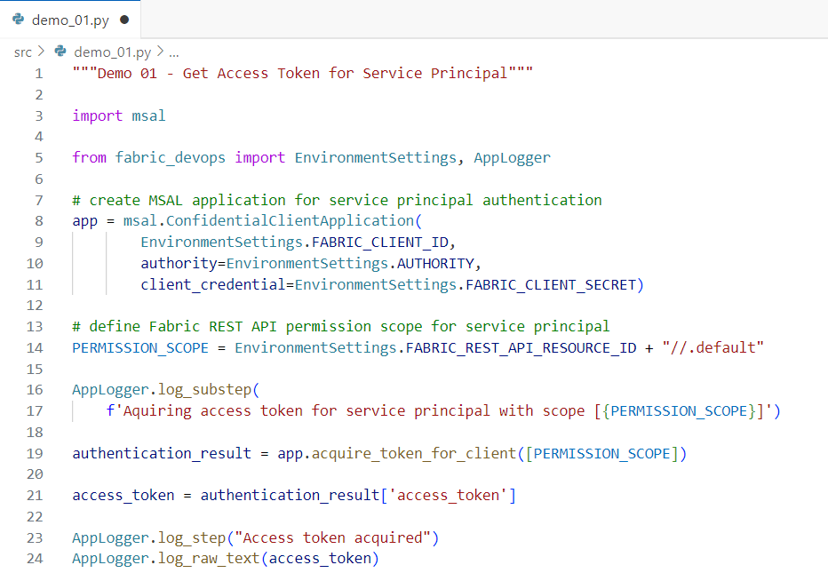

### Demo 02 - Acquire Access Token for Interactive User

Xxxxx


### Demo 03 - Acquire Access Token for User with Device Code

Xxxxxx

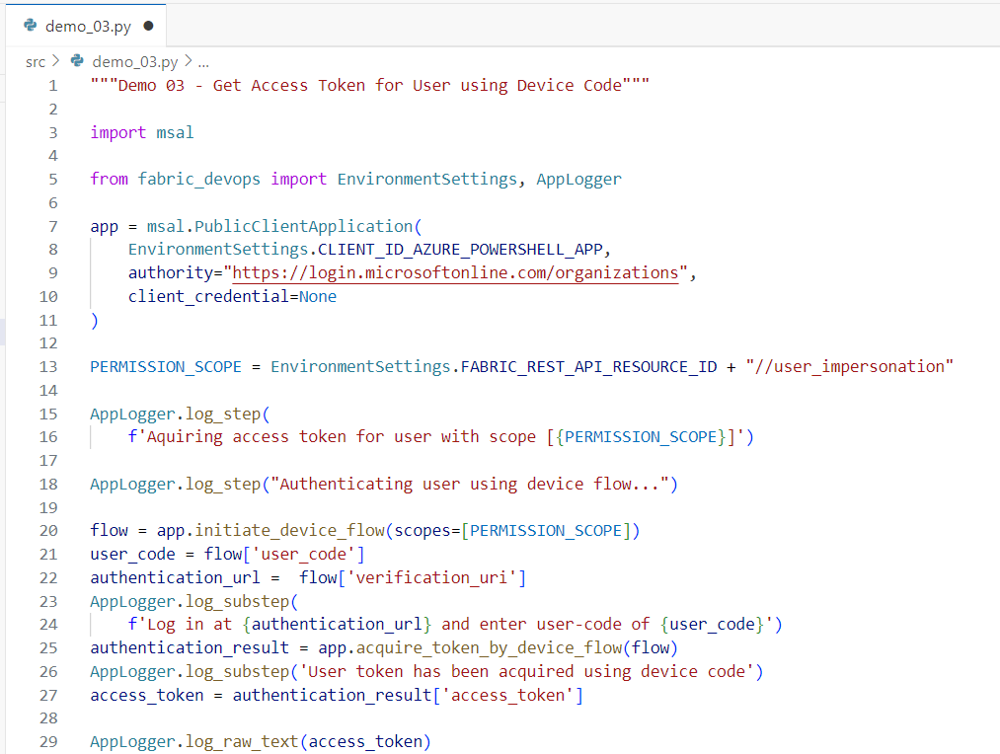

### Demo 04 - Execute Fabric REST API Call to List Workspaces

Xxxx

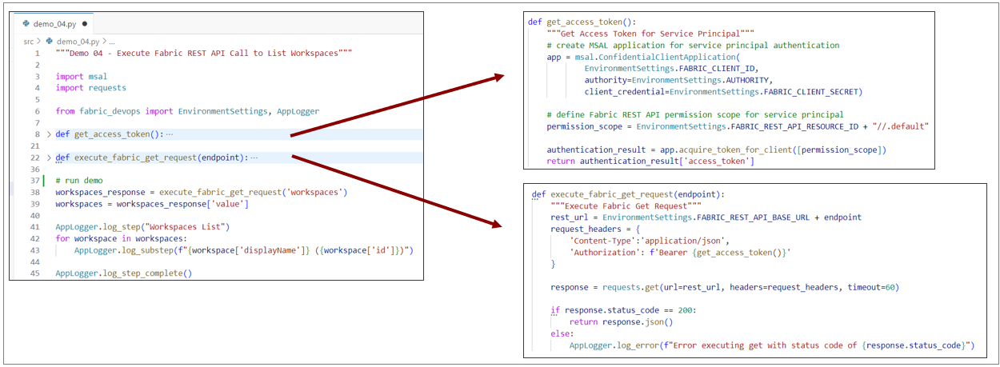

Ssss

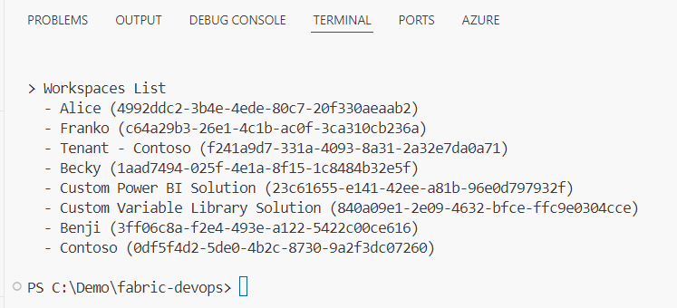

### Demo 05 - Execute Fabric REST API Call to List Capacities You Need a Fabric Capacity Id for Testing. 

### 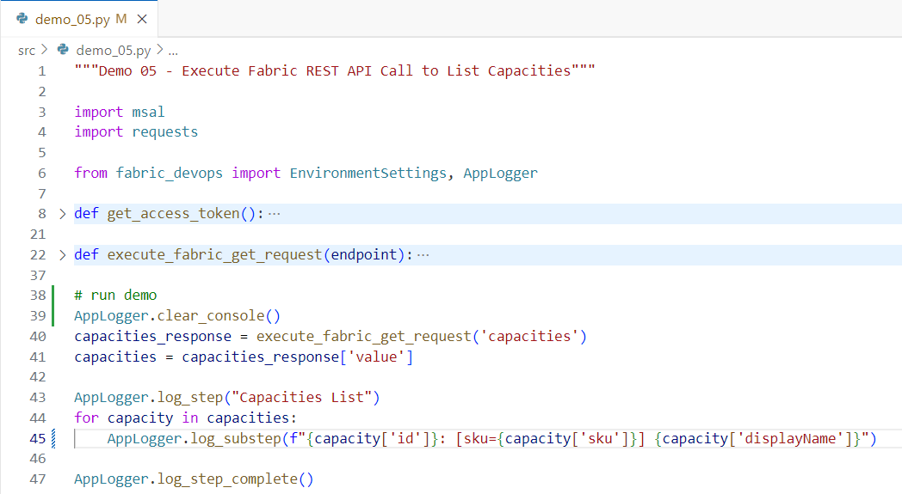

Copy the capacity ID of a capacity based on F SKU, FT SKU or P SKU

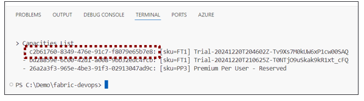

### Demo 06 - Execute Fabric REST API to Create Workspace

Xxxxx

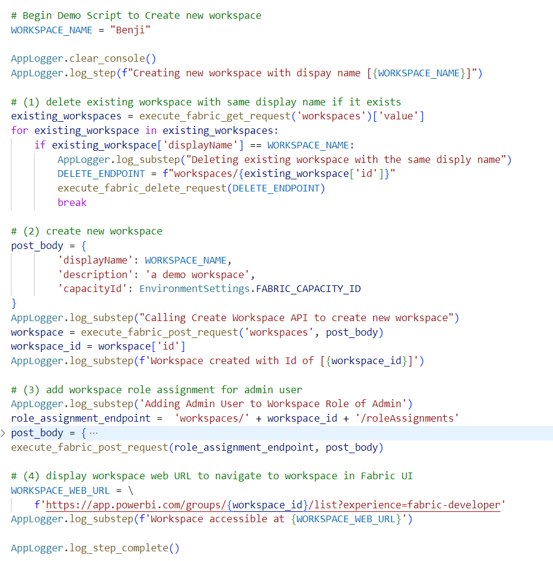

Handling Longing Running Operations in POST Requests

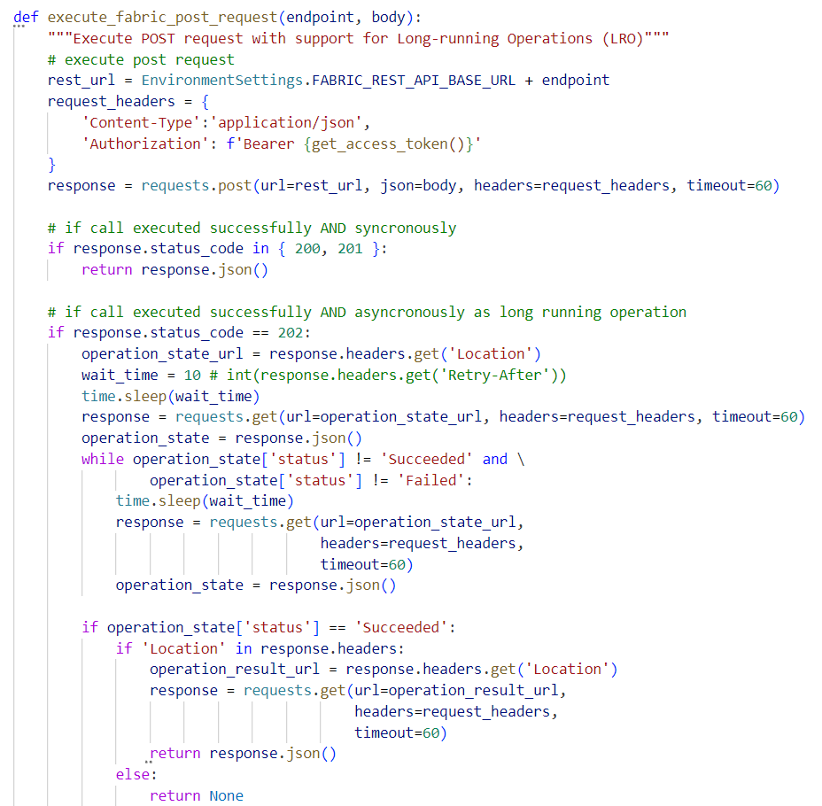

### FabricRestApi class

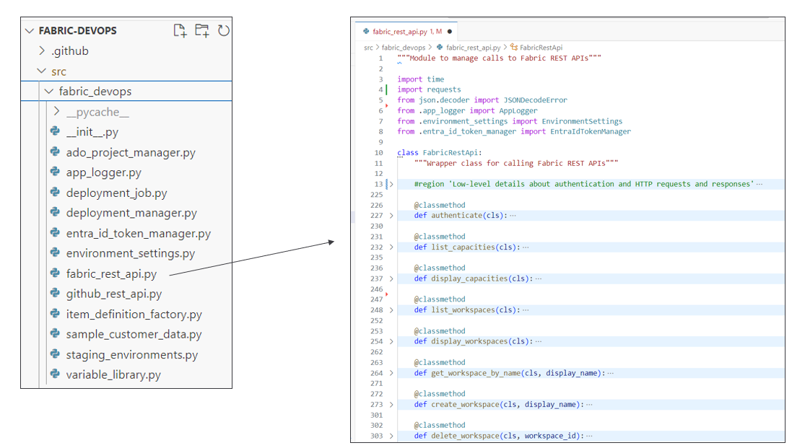

Xxx

### Demo 07 - Create Workspace using FabricRestApi Class xxx

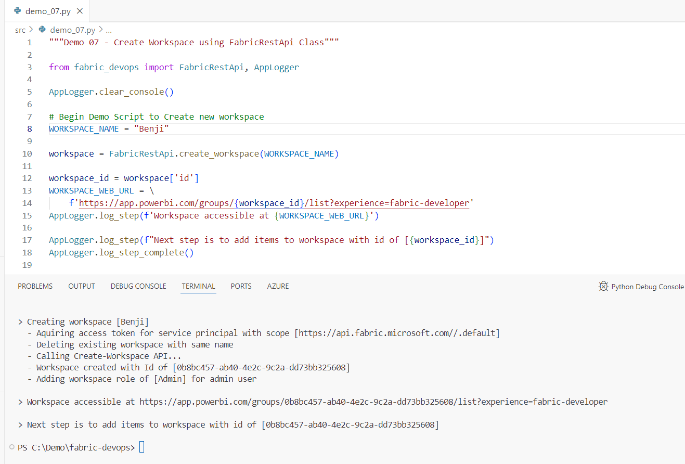

### Demo 08 - Deploy Complete Fabric Solution

ssss

### Coming Soon: The Fabric REST API Python SDK

Python SDK for Fabric REST API adds valuable productivity boost

- Abstracts away executing HTTP requests, adding **Authorization**
  header and handling responses

- Parses together target REST URLs containing workspace Id, item Ids and
  specific endpoints

- Handles serializing/deserializing JSON payloads sent back and forth
  over the wire

- Provides automatic support for API calls which implement
  **long-running operations (LRO)** pattern

- Provides automatic support for dealing with **continuation tokens**
  and merging **paginated results**

``` python

def deploy_fabcon_solution(

        target_workspace,

        deploy_job = StagingEnvironments.get_dev_environment()):

    """Deploy FabCon Solution"""

    bronze_lakehouse_name = "sales_bronze"

    silver_lakehouse_name = "sales_silver"

    gold_warehouse_name = "sales"

```

